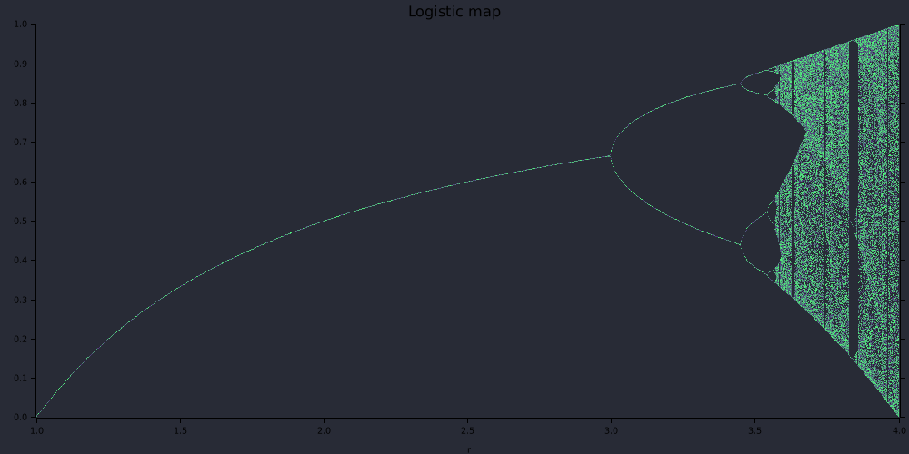

# Logistic map generator

https://en.wikipedia.org/wiki/Logistic_map



```
cargo build --release
./target/release/logistic_map --help
./target/release/logistic_map 0 4 0 1 --output-file fullview.png
./target/release/logistic_map 3.5 3.8 0 1 --height=1500 --output-file chaos.png
./target/release/logistic_map 3.702 3.703 0.49 0.51 --density 2000 --output-file zoomed_in.png
```
